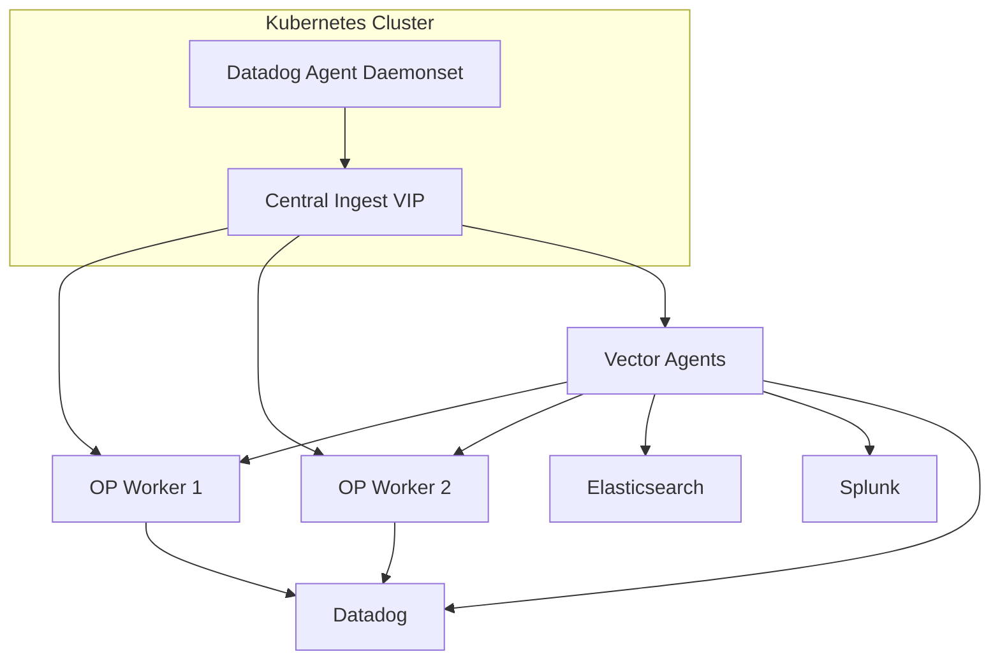

# Vector Centralized Deployment

This repository provides an example of deploying [Vector](https://vector.dev/) in a centralized topology using Ansible and Docker.

Vector will run in a container and accept logs, metrics, and traces from multiple sources:

- **Datadog agents** via `vector` and `statsd` sources.
- **Splunk** forwarders via `syslog` or `http`.
- **OpenTelemetry (OTEL)** collectors via the `otlp` source.
- **Filebeat** via `syslog`.

Logs, metrics, and traces can be processed with VRL transforms and then routed to Datadog Observability Pipelines or sent directly to other sinks such as Datadog, Elasticsearch, and Splunk. The example configuration chains a `remap`, `filter`, `sample`, and `route` transform to demonstrate steering events to different destinations. The Observability Pipeline workers themselves are deployed separately; Vector simply forwards events to them via HTTP.


Placeholders are used for tokens and endpoint URLs. Update them for your environment before deployment.

## Directory Structure

```
vector-test/
  ansible/
    deploy.yml            # Playbook to deploy Vector
    hosts.ini             # Inventory file with hosts
    roles/
      vector/
        tasks/main.yml    # Tasks to run Vector container
        templates/
          vector.yaml.j2  # Vector configuration template
  docker-compose.yml
  filebeat.yml
  otel-collector-config.yaml
  vector.yaml
```

## Quick Start

1. Edit `ansible/hosts.ini` and add the hosts where Vector should run.
2. Edit `ansible/roles/vector/templates/vector.yaml.j2` to customize sources, transforms, and sinks.
3. Run the playbook:

```bash
ansible-playbook -i ansible/hosts.ini ansible/deploy.yml
```

Docker must be installed on the target host(s). The playbook will copy the Vector configuration and run the container.

## Standalone Docker

If you prefer to run Vector manually on a single host you can start the container directly with Docker:

```bash
docker run -d --name vector \
  -v $(pwd)/vector.yaml:/etc/vector/vector.yaml:ro \
  -e DD_API_KEY=YOUR_DD_API_KEY \
  -e SPLUNK_TOKEN=YOUR_SPLUNK_TOKEN \
  -p 4317:4317 -p 10514:10514 -p 9001:9001 -p 8125:8125 -p 1514:1514 \
  timberio/vector:0.36.X-alpine
```

The command mounts the configuration from this repository and exposes the ports used by the sample config. Adjust tokens and endpoints as needed.


## Local Docker Compose

For local proof-of-concept testing you can run the stack with Docker Compose.
The provided `docker-compose.yml` file starts Vector along with a Datadog Agent,
Filebeat, an OpenTelemetry Collector and a small log generator. Observability
Pipeline workers are assumed to run elsewhere.

1. Install Docker and Docker Compose.
2. Optionally set `DD_API_KEY` and `SPLUNK_TOKEN` in your environment.
3. Launch the stack:

```bash
docker-compose up
```

Logs written by the `logger` container are picked up by Filebeat and the OTEL
collector, then forwarded to Vector. The Datadog Agent also ships its own logs
to the Vector service. Review `vector.yaml` and the other config files in this
directory to adjust sources or sinks.


## Kubernetes Deployment with Datadog Agents

This example assumes the Datadog Agent is already deployed as a Helm chart in multiple Kubernetes clusters. To forward container logs to the centralized Vector instance you can override the following values in the chart:

```yaml
# values.yaml snippet
 datadog:
   logs:
     enabled: true
     containerCollectAll: true
   env:
     - name: DD_LOGS_CONFIG_DD_URL
       value: "http://VECTOR_VIP:9001"
     - name: DD_LOGS_CONFIG_LOGS_DD_URL
       value: "http://VECTOR_VIP:9001"
```

Replace `VECTOR_VIP` with the address of the central ingest VIP in front of Vector. Metrics and traces can also be pointed at this VIP or continue to use the default Datadog endpoints depending on your requirements. Observability Pipeline workers should also be reachable from Vector so that log routing works.

### Running Vector in Kubernetes

Vector can also run as a Deployment inside your cluster. First create a ConfigMap with the `vector.yaml` configuration and then deploy a Deployment and Service:

```yaml
apiVersion: v1
kind: ConfigMap
metadata:
  name: vector-config
data:
  vector.yaml: |
    # contents of vector.yaml
---
apiVersion: apps/v1
kind: Deployment
metadata:
  name: vector
spec:
  replicas: 2
  selector:
    matchLabels:
      app: vector
  template:
    metadata:
      labels:
        app: vector
    spec:
      containers:
      - name: vector
        image: timberio/vector:0.36.X-alpine
        args: ["--config", "/etc/vector/vector.yaml"]
        ports:
        - containerPort: 9001
        - containerPort: 8125
        volumeMounts:
        - name: config
          mountPath: /etc/vector
      volumes:
      - name: config
        configMap:
          name: vector-config
---
apiVersion: v1
kind: Service
metadata:
  name: vector
spec:
  type: LoadBalancer
  selector:
    app: vector
  ports:
  - port: 9001
    targetPort: 9001
```

Agents can then send logs to the service VIP while Vector forwards them on to Observability Pipelines or other sinks.

## Architecture



All logs, metrics and traces are sent from the Datadog Agents to the central VIP. Vector can either forward events to the externally managed Observability Pipeline workers or send them straight to other sinks such as Datadog, Elasticsearch or Splunk depending on VRL routing rules.
