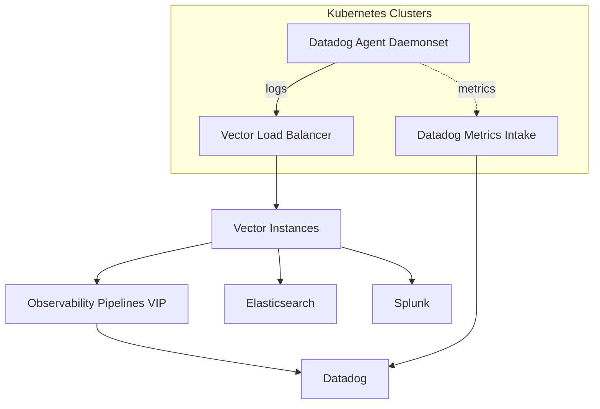

# Vector Centralized Deployment

This repository provides an example of deploying [Vector](https://vector.dev/) in a centralized topology using Ansible and Docker.

Vector will run in a container and accept logs and metrics from multiple sources:

- **Datadog agents** via `vector` and `statsd` sources.
- **Splunk** forwarders via `syslog` or `http`.
- **OpenTelemetry (OTEL)** collectors via the `otlp` source.
- **Filebeat** via `syslog`.

Logs and metrics can be processed with VRL transforms and shipped to sinks such as Datadog, Elasticsearch, and Splunk. The example configuration shows a simple `remap` transform that adds tags, followed by a `filter` that keeps only error-level events and a `sample` transform that forwards a percentage of messages.

Placeholders are used for tokens and endpoint URLs. Update them for your environment before deployment.

## Directory Structure

```
vector-test/
  ansible/
    deploy.yml            # Playbook to deploy Vector
    inventory             # Inventory file with hosts
    roles/
      vector/
        tasks/main.yml    # Tasks to run Vector container
        templates/
          vector.yaml.j2  # Vector configuration template
```

## Quick Start

1. Edit `ansible/inventory` and add the hosts where Vector should run.
2. Edit `ansible/roles/vector/templates/vector.yaml.j2` to customize sources, transforms, and sinks.
3. Run the playbook:

```bash
ansible-playbook -i ansible/inventory ansible/deploy.yml
```

Docker must be installed on the target host(s). The playbook will copy the Vector configuration and run the container.


## Kubernetes Deployment with Datadog Agents

This example assumes the Datadog Agent is already deployed as a Helm chart in multiple Kubernetes clusters. To forward container logs to the centralized Vector instance you can override the following values in the chart:

```yaml
# values.yaml snippet
 datadog:
   logs:
     enabled: true
     containerCollectAll: true
   env:
     - name: DD_LOGS_CONFIG_DD_URL
       value: "http://VECTOR_VIP:9001"
     - name: DD_LOGS_CONFIG_LOGS_DD_URL
       value: "http://VECTOR_VIP:9001"
```

Replace `VECTOR_VIP` with the address of the load balancer in front of the Vector deployment. Metrics do not need a custom endpoint and will continue to flow directly to Datadog using the standard site settings.

## Architecture



Logs are forwarded from the Datadog Agents through the Vector VIP. Vector processes the events with VRL and then ships them to your Observability Pipelines endpoint before ultimately sending them to Datadog, as well as to any additional sinks such as Elasticsearch or Splunk.
